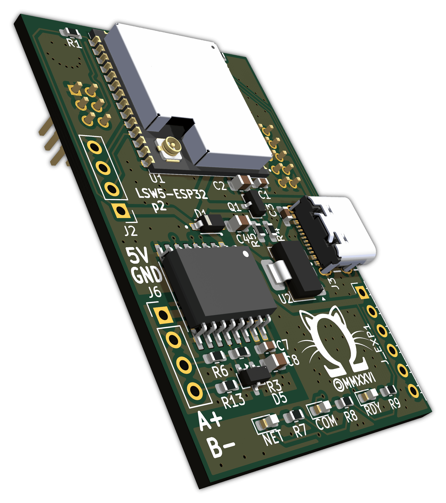

# lsw5-esp32

> ESP32-based replacement PCB for the Deye/Sofar/Igen/Solarman/... LSW-5 *Stick Logger* with RS-485 CT meter emulation

This is a replacement ESP32-S3 daughterboard for the "LSW-5" *Stick Logger* (FCC ID [2A4FRLSW-5](https://fccid.io/2A4FRLSW-5)).

It replaces the original board, which is based on a [Hi-Flying HF-LPT270](http://www.hi-flying.com/hf-lpt270) [^lpt270] ([BL602](https://en.bouffalolab.com/product/?type=detail&id=1) inside[^lpt270-wasted-potential-rant]). With an ESP32-S3, it enables ESPHome support while keeping the *Stick Logger*'s modern, minimalistic appearance intact[^rs485-hole].

## Compatibility

* **Target Device**: LSW-5 *Stick Logger*, FCC ID: [2A4FRLSW-5](https://fccid.io/2A4FRLSW-5) and others (for example, mine, which does not have an FCC ID printed on it). May also fit the [2BC8DLSW-5](https://fccid.io/2BC8DLSW-5) (not verified, no internal photos), or other types of *Stick Logger*.
  * If your *Stick Logger* looks similar to the FCC photos, this board may fit regardless of whether the inverter-side connector is USB, DB-9, or the round 4-pin type.
* **Connection**: This board replaces the internal daughterboard connected via two (2x3, 2x5) socketed 2 mm pin headers.

## Features

* **ESP32-S3** (WROOM-1U-N16R8) with WiFi, BLE and a USB-C port for flashing/debugging.
* Works with **ESPHome**.
* 2.54 mm **expansion header** with 4 GPIOs with no predetermined function. Add a temperature sensor, I²C display, or any peripheral supported by ESPHome (or any other software you choose to run).
* **Open source hardware** designed in KiCad.
* Isolated **RS-485** transceiver for meter emulation.
  * Requires external 5V supply, as available from the *Meter-485* port in (some?) Deye hybrid inverters. Or use a phone charger to power it.[^rs485-isolation]
  * One isolated RS-485 port is present, but it could *potentially* be used for both meter emulation and BMS communication by connecting those to the same bus and configuring addresses appropriately; the Deye DSP firmware is hardcoded to use `1` for the "external CT" meter and `2` for the "Grid Tie Meter2" so these addresses are not available for BMS use. Unsure about address `0`.
    * You could definitely choose to use it *only* for BMS communication, with projects like [esphome-jk-bms](https://github.com/syssi/esphome-jk-bms)
* **LEDs**: on-board status LEDs (NET, RDY, COM) matching the translucent windows in the stock case mapped to ESP32 GPIOs.

## Hardware

The design files (schematics and PCB layout) are available in this repository.

### Pinout

| Function                               | ESP32 pin         | Location                      | Remarks                                                                     |
| :------------------------------------- | :---------------- | :---------------------------- | :-------------------------------------------------------------------------- |
| **3.3V input** from carrier board      | `3V3`             | J4 pins 5, 6                  |                                                                             |
| **GND** from carrier board             | `GND`             | J1 pins 1, 2, 3; J4 pins 9, 10 |                                                                             |
|                                        |                   |                               |                                                                             |
| **RX from inverter** (RS232 [^rs232])  | `GPIO16`          | J4 pin 8                      |                                                                             |
| **TX to inverter** (RS232)             | `GPIO17`          | J4 pin 7                      |                                                                             |
| **RX from RS485**                      | `GPIO21`          | onboard                       |                                                                             |
| **TX to RS485**                        | `GPIO48`          | onboard                       |                                                                             |
| **DE to RS485**                        | `GPIO47`          | onboard                       |                                                                             |
|                                        |                   |                               |                                                                             |
| **ESP32 boot mode**                    | `GPIO0`           | J1 pin 4                      | Connected to GND by the momentary switch on the bottom of the carrier board |
| **RX(?) from SIM card slot**           | `GPIO5`           | J4 pin 1                      | Slot is not populated on the carrier board, can use as GPIO                 |
| **TX(?) from SIM card slot**           | `GPIO4`           | J4 pin 4                      | Slot is not populated on the carrier board, can use as GPIO                 |
|                                        |                   |                               |                                                                             |
| **NET** LED                            | `GPIO40`          | onboard                       | Active low                                                                  |
| **COM** LED                            | `GPIO38`          | onboard                       | Active low                                                                  |
| **RDY** LED                            | `GPIO39`          | onboard                       | Active low                                                                  |
|                                        |                   |                               |                                                                             |
| **Programming port**[^usbc] 3.3V input | `3V3`             | J2 pin 1                      |                                                                             |
| **TX to external UART programmer**     | `TXD0` / `GPIO43` | J2 pin 2                      | Mind the startup messages                                                   |
| **RX from external UART programmer**   | `RXD0` / `GPIO44` | J2 pin 3                      |                                                                             |
| **GND**                                | `GND`             | J2 pin 4                      |                                                                             |
|                                        |                   |                               |                                                                             |
| **Expansion port:** 3.3V               | `3V3`             | J_EXP1 pin 1                  |                                                                             |
| Unassigned                             | `GPIO9`           | J_EXP1 pin 2                  |                                                                             |
| Unassigned                             | `GPIO10`          | J_EXP1 pin 3                  |                                                                             |
| Unassigned                             | `GPIO11`          | J_EXP1 pin 4                  |                                                                             |
| Unassigned                             | `GPIO12`          | J_EXP1 pin 5                  |                                                                             |
| GND                                    | `GND`             | J_EXP1 pin 6                  |                                                                             |
|                                        |                   |                               |                                                                             |
| **5V input** for RS485 transceiver     |                   | J6 pin 1                      |                                                                             |
| **GND** for RS485 transceiver          |                   | J6 pin 2                      |                                                                             |
| RS485 **A/+**                          |                   | J6 pin 3                      |                                                                             |
| RS485 **B/-**                          |                   | J6 pin 4                      |                                                                             |

## Errata

Board revisions refer to manufactured Gerber releases, tagged in Git as `p0`, `p1`, etc. The current KiCad files may already contain changes for the next unreleased revision; those changes are not listed here until a board is manufactured. For example, if the schematic says `p2` but there is no `p2` tag, that revision has not been manufactured yet.

Errata are listed by the newest affected revision. Older revisions also inherit the errata listed above them. For example, a `p0` board has both the `p1` and `p0` errata.

* `p1`
  * RS485 port: GND/5V labels swapped on silkscreen
  * Carrier board pin headers: silkscreen is on the wrong side
  * R5 should be 10 kΩ, not 100 kΩ
  * COM and NET LED labels swapped on silkscreen
  * LEDs are connected backwards compared to the intended design
  * RS485 bus interface includes series resistors, changed to 0 Ω at the moment, but either way they are not in a good place for proper termination (as the 120 Ω termination resistor is *after* the series resistor, not before), so they should probably be removed completely
* `p0`
  * No revision label on silkscreen
  * Non-isolated RS485 transceiver is used

## Firmware

[ESPHome](https://github.com/esphome/esphome), I suppose? This board is compatible with various existing ESPHome configurations (sometimes requiring minor adjustments).

* **[esphome-deye-inverter](https://github.com/Lewa-Reka/esphome-deye-inverter)**: A very comprehensive configuration for Deye inverters, including probably all of the sensors and switches you could ever want.
* **[esphome-for-deye](https://github.com/klatremis/esphome-for-deye)**: The classic.
* **[Sunsynk-Home-Assistant-Dash](https://github.com/slipx06/Sunsynk-Home-Assistant-Dash/tree/main/ESPHome%20Configs)**: You'll need to adjust the UART pins.
* *[your configuration here?]*

### Example configuration for board-specific features

A sample [`esphome/lsw5-esp32.yaml`](./esphome/lsw5-esp32.yaml) file is included in this repository. It serves as a starting point, illustrating the correct pin mappings for this specific board. It includes basic MQTT setup and RS-485 configuration for external meter emulation with source data over MQTT, as well as LED support.

> [!NOTE]
> The inverter polls the RS-485 meter every 125 ms, except every 10th attempt which is delayed by 125 ms as the inverter tries to write `float32(0.0)` to register 286 on device 0xab. I have not been able to identify the reason / meaning of this.
>
> You should aim to keep the data in your emulator as fresh as possible to minimize over/undershooting of the *Zero Export to Grid* feature under meter emulation.

## License

The hardware design files are licensed under the CERN Open Hardware Licence Version 2 - Strongly Reciprocal (CERN-OHL-S-2.0). See [LICENSE](./LICENSE) for details.

The example ESPHome configuration is based on an Apache-2.0-licensed configuration and has been modified for this project. It is distributed under the Apache License, Version 2.0. See [esphome/LICENSE](./esphome/LICENSE) and [esphome/NOTICE](./esphome/NOTICE) for details.

All other supporting files and tools are licensed under the GNU Affero General Public License Version 3 or, at your option, any later version (AGPL-3.0-or-later). See [fake-inverter/LICENSE](./fake-inverter/LICENSE) for details.

> [!CAUTION]
> Please be careful with electricity, always disconnect the *Stick Logger* from the inverter before replacing its internal board, always turn off the inverter and disconnect it from all power sources before (dis)connecting the *Stick Logger*, and so on. I will not be responsible if your warranty is voided, your inverter is damaged, or you get shocked. If you are not sure about something, ask for help from someone who is qualified to work with power electronics.

----------

[^lpt270]: https://fccid.io/2ACSVHF-LPT270-0F
[^lpt270-wasted-potential-rant]: ...along with an unidentified tiny MCU, maybe a PIC clone? Also, what a waste to have a literal 200 MHz RISC-V core with 276 KB of RAM[^lpt270-why-not] already onboard in the WiFi 'can' (a similar 'can' is $2 at qty:1 from Ai-Thinker BTW), and still use a tiny external MCU for *something*. I guess they prefer reusing the software on this external MCU in the Ethernet / LTE *Stick Loggers* over using the most elegant solution and saving a few cents to boot?
[^rs485-hole]: unless you decide to cut a hole in the case to route out the Meter-485 cable. Or cut a bit of the plastic around the DB-9 plug out and route it there, but there is a risk of forgetting about the additional cable and causing damage when enthusiastically removing the *Stick Logger*. Or route it through the reset button hole.
[^rs485-isolation]: Added in `p1`, the story is that it would work fine until connecting the RS-485 (then all sorts of weird stuff would happen). I had seen some noise between the `GND`s in the RS-485 port and the RS-232 port, and the fact that they are not electrically connected, so I decided to make an isolated revision. Then it turned out that with 3cb155f6de7685bc65d782d9486902e5723dc495 my p0 board works on the bench, but isolation seems to be a good idea regardless.
[^rs232]: Through the RS232 transceiver on the carrier board inside the *Stick Logger* which this board plugs into.
[^usbc]: Recommended to use the USB-C port for programming instead
[^lpt270-why-not]: If it's so good, then why didn't I use it? Mostly because the software development experience looks bad compared to the ESP32. Also I'm not sure how annoying having the mystery MCU between us and the RS232 port would be.
